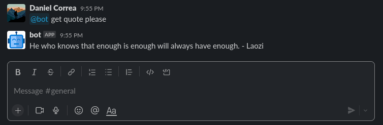
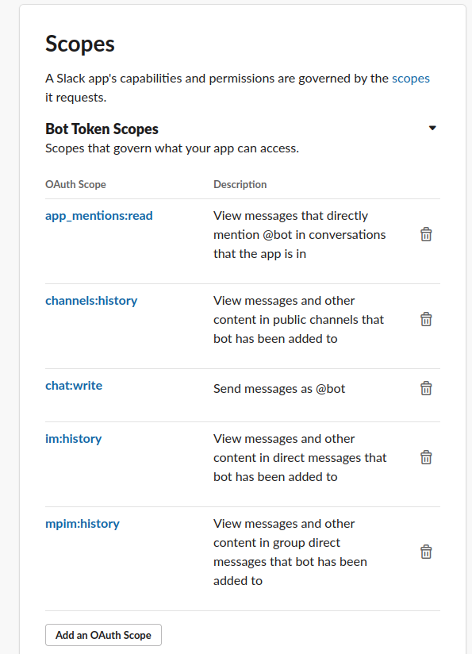

### Welcome

> my slack bot relies on the repo [shomali11/slacker](https://github.com/shomali11/slacker)
> 
My slack bot is very simple and for now only gets a random quote(credits to [quotable.io](quotable.io))

To call the bot you must write `get quote please` like the following example

> it doesn't matter whether the bot is pinged or not
> 


## configuration
You first need to create an app in the slack api

The slack app requires to have socker mode enable at the slack api and provide a .env file with the following info

```
SLACK_BOT_TOKEN="<bot_token>"
SLACK_APP_TOKEN="<app_token>" 
```

The bot token can be get in the sections of `App > Features > OAuth & Permissions`
> Remember assign the appropiate scopes, chat:write is needed in the bot token and app_mentions:read is recommended, this activates the bot when it is pinged

my current config is the following
